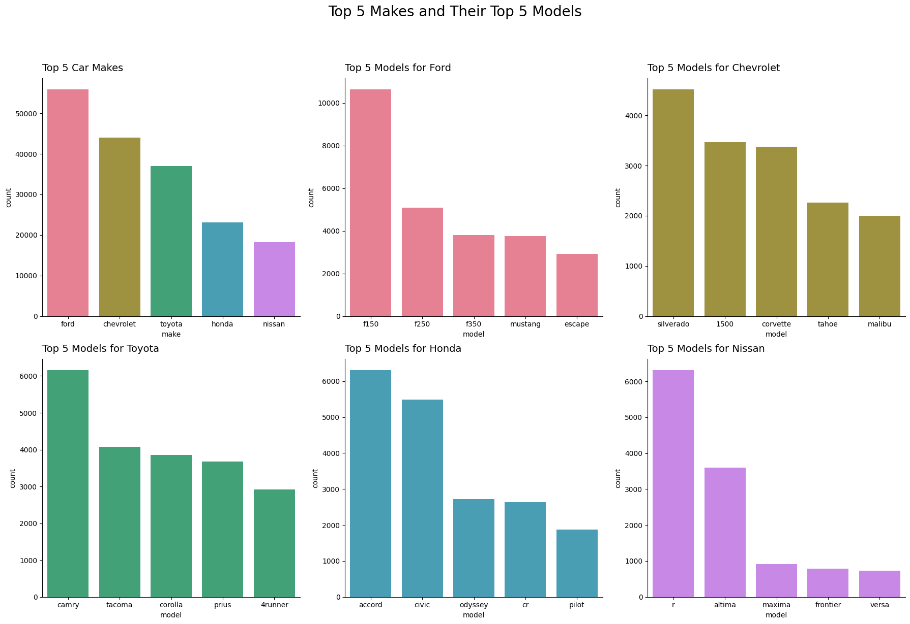

### Jacob Clement
### Data Visualization
### 9/23/2024

The submissions for: (Easy) Build a visualization that illustrates what makes and models of cars are most popular. is graphs\top_makes_and_models_combined.png.

https://chatgpt.com/share/66f118dd-41e0-800a-b8a6-3ca307669811

I used plotly to create the submissions for: (Easy) Build a visualization that visualizes the annual pattern of entries into the HMIS. The product is html\better_line_chart.html. I took a snip as well and saved it in the graphs folder

https://chatgpt.com/share/66f19463-ebd0-800a-bec1-e114d331529f

For (Easy) Build a visualization that illustrates the patterns in purchases by time of day for both the Front Street and Central locations. I made way to many graphs. I just used matlibplot and loops. I did discover several interseting characteristics of the data. There are some hours with negative sales. Also, there are some transactions outside of normal business hours. To make the vistualization consistent and simple, I did some filtering and included only two of the locations for a limited set of hours. I want to add the overall title "Similar Weekend Business Patterns Across Locations" but neither ChatGPT o I could figure it out at the time of the writing. 

https://chatgpt.com/share/66f1aed3-6c2c-800a-9dbf-364ba58009de

On (Medium) Build a visualization that attempts to answer this question: When do cars tend to be posted by location? I once again made way too many graphs but this time they are in an interactive graph where you can pick location from a drop down menu. Based on a look at the overall data shows that the distributions of postings by day of the month and day of the week are relatively uniform. There might be an increase in postings on Saturday and there is possibly a spike in posting near the end of the month. The histogram of postings by hour shows a near normal distribution of postings centered on the daylight hours. Therefore, I created visualizations by hour for the final product.

The screen capture below is just a static view of the interactive plot. You can select from the top 25 locations and the view that locations histogram of postings. The html is here: html\interactive_histogram_by_location.html.

https://chatgpt.com/share/66f1c967-e524-800a-ab04-ecb887bea409

